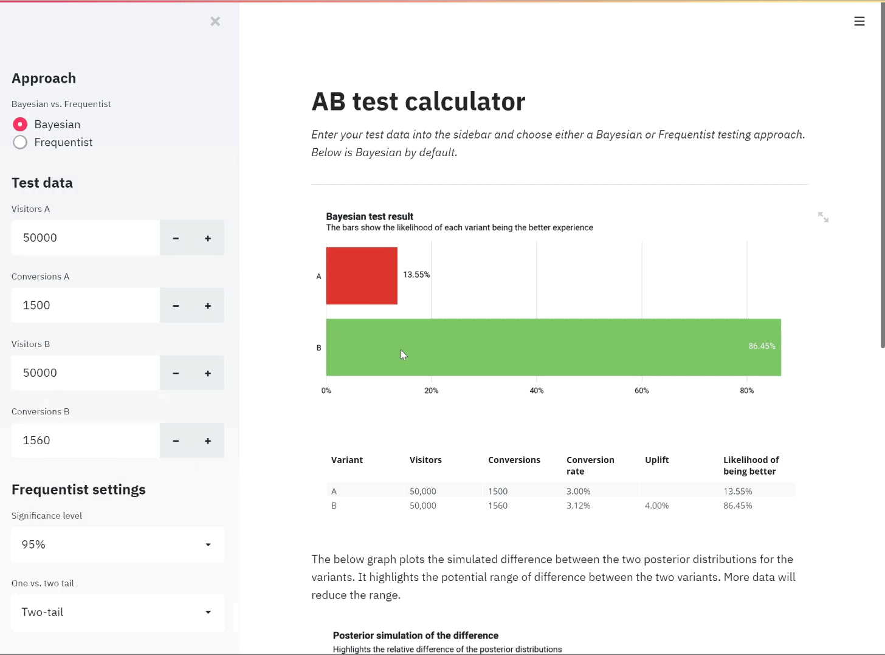

# AB Test Calculator

An AB test significance calculator with options to use Bayesian or Frequentist statistics. Calculations come through basic SciPy.stats methods, the web app is built with Streamlit and hosted on Heroku. See it live [here](https://abtestcalculator.herokuapp.com/).

<p align="center">
  
</p>

See also my [AB test sample size calculator](https://github.com/rjjfox/ab-test-samplesize).

## Table of Contents

- [Getting Started](#getting-started)
- [Deployment](#deployment)
- [Built With](#built-with)
- [License](#license)

## Getting Started

These instructions will get you a copy of the project up and running on your local machine for development and testing purposes. See deployment for notes on how to deploy the project on a live system.

## Installing

Clone/fork the repo onto your local machine.

It is then recommended to use a virtual environment to install the dependencies using the requirements.txt file.

```cli
pip install -r requirements.txt
```

With these installed, you simply need to run

```cli
streamlit run app.py
```

### Docker

Alternatively, with Docker, use the following command and then navigate to localhost.

```
docker run -p 80:8080 ryanfox212/ab-test-calculator
```

## Deployment

I utilised Heroku's free tier to host the web app. To do the same, create a project on Heroku's website and then I recommend linking the project to a Github repository in the Deploy section.

Alternatively, you can use the [Heroku CLI](https://devcenter.heroku.com/articles/heroku-cli). Provided you have already created a project on the site, use

```cli
heroku git:remote -a [project-name]
git push heroku master
```

Use the same project name as the one you created. If successful, you can then go to `https://[project-name].herokuapp.com/`.

## Built With

- [Streamlit](https://www.streamlit.io/) - The web application framework used
- [SciPy](https://www.scipy.org/) - For the statistical methods
- [Seaborn](https://seaborn.pydata.org/) - For vizualisations
- [Heroku](https://heroku.com/) - Cloud platform used for deployment

## License

This project is licensed under the MIT License - see the [LICENSE](LICENSE) file for details.
